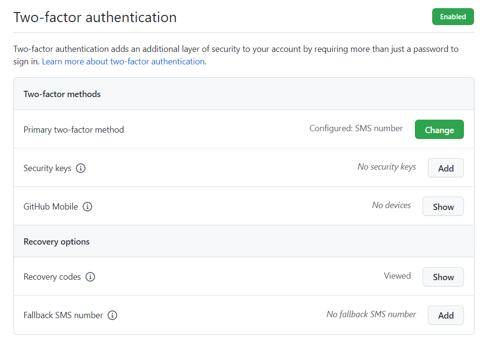

# Hito 0

## Descripción del Proyecto

En los últimos años el hobby de los juegos de mesa ha sufrido una creciente popularización, lo que ha llevado a la aparición en el mercado de un gran número de nuevos títulos por parte de las editoriales. Los amantes de este hobby se encuentran con una enorme oferta, pero resulta tedioso la tarea de comprobar si un juego encaja con los gustos de cada jugador. Muchos titulos pasan desapercibidos por parte de la mayoría del público, ya sea por falta de publicidad o por ser ensombrecidos por otros títulos.

En este proyecto buscamos crear un espacio donde los apasionados de los juegos de mesa puedan descubrir nuevos juegos, intercambiar impresiones y hacer comunidad. Entre otras cosas los usuarios podrán:

<ul>
    <li>Comentar sobre sus juegos favoritos</li>
    <li>Puntuar los diferentes juegos</li>
    <li>Encontrar nuevos juegos basados en sus preferencias</li>
    <li>Mantener un listado de los juegos en propiedad</li>
</ul>


## Configuracion del Entorno de Desarrollo


### Elegir Licencia del Proyecto

A la hora de crear el repositorio hemos elegido la licencia _AGPL-3.0 license_.


### Configuración Claves Público/Privadas

A continuación vamos a crear una clave pública y privada para la cuenta de Github con el que poder realizar commits desde la consola de comandos.

En primer lugar, vamos a crear las claves, para ellos utilizaremos el siguiente comando:

```
$ ssh-keygen -t ed25519
```

Resultado de la ejecución:


Una vez generada las claves, añadimos la clave privada a ssh:

```
$ ssh-add githubKey
```


Por último, añadimos la clave pública a nuestra cuenta de github, en nuestro caso, el contenido del archivo _githubKey.pub_


Una vez realizados estos pasos, habríamos acabado de configurar git. Para realizar este apartado hemos seguido <a href="https://docs.github.com/es/authentication/connecting-to-github-with-ssh/generating-a-new-ssh-key-and-adding-it-to-the-ssh-agent" title="Documentacion github">la documentación de github</a>.


### Configuración Commits

Vamos a configurar el nombre y el email que aparece en los commits que realicemos. Para ello ejecutaremos los siguientes comandos:

```
git config --global user.name "David Cabrera"
git config --global user.email "davidch@ugr.es"
```

La opción --global hará que la configuración sea utilizada en todos los repositorios. Para realizar este apartado hemos seguido <a href="https://www.git-tower.com/learn/git/faq/change-author-name-email/" title="cambiar autor y email">un FAQ sobre git de la página web git-tower</a>.

### Activar Segundo Factor de Autenticación

En el apartado _Settings_ seleccionamos _Password and authentication_ y en _Two-factor authentication_ seguimos los pasos hasta completar la activación. Una vez terminado nos debería aparecer algo similar a lo siguiente:




### Editar Perfil

Hemos editado el perfil de github para indicar que somos estudiantes del master en ingeniería informática en la UGR. Esta función se encuentra justo debajo de nuestra foto de perfil.

