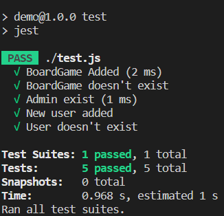
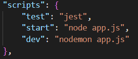

# Hito 2

## Test

La realización de test unitarios en nuestro proyecto nos permite asegurar la calidad de nuestro software, así como mitigar la introducción de bug conforme el proyecto evolucione. Sin embargo, tendremos que tener cuidado con no acoplar en exceso los test con el código, para evitar que un minimo cambio en el proyecto conlleve que tengamos que modificar multiples tests.

Debemos tener en cuenta el mayor número de casos posibles, evitando sobre todo no llevar a cabo solo test sobre casos ideales, puesto que precisamente son aquellos que menos vamos a tener en cuenta al modificar nuestro código.

Existen multiples librerias para realizar test en javascript, como por ejemplo: Mocha, Jest, Playwright, NodeUnit, jsUnit, Cypress, Vitest, Puppeteer, Testing Library, Jasmine, Storybook, AVA, Should o WebdriverIO. Entre ellas, Mocha parece ser la más popular, pero requiere de una gran cantidad de librerías, por lo que nos hemos decantado por <a href="https://jestjs.io/">Jest</a>, los motivos para ello son que Jest dispone de una buena documentación, es fácil de configurar y utilizar, y además, es desarrollado por una gran empresa, Facebook, pero sin dejar de ser <a href="https://github.com/facebook/jest">software libre</a>, permitiendo que cualquiera pueda colaborar en el proyecto, lo que nos transmite confianza sobre la posibilidad de que no aparezcan errores durante el desarrollo. 

Para instalar Jest hemos ejecutado la siguiente instrucción en la linea de comandos:

```
npm install --save-dev jest
```

Una vez creada en nuestro proyecto el archivo test.js podemos ejecutar los test utilizando la orden:

```
npm test
```



En la etapa actual de desarrollo hemos creado una clase <i>DataBaseMock</i> que se encarga de enmascarar la funcionalidad de la base de datos, permitiendo poder elegir la que mejor nos convenga con la mayor información posible una vez hayamos avanzado lo máximo posible en el proyecto.

## Gestor de Tareas

Como gestor de tareas vamos a utizar <i>npm</i>, que además es utilizado para instalar paquetes de un repositorio remoto, control de versiones y manejo de dependencias. Hemos elegido npm como gestor de dependencia porque no necesitamos añadir librerias adicionales, así como su sencillez de uso.

Para ejecutar la aplicación utilizamos <i>nodemon</i>:

```
npm run start
```

Por otro lado, si queremos volver a descargar las librerias para generar una build nueva podemos utilizar:

```
npm ci
```

En el apartado anterior hemos comentado tambien como utilizar <i>npm</i> para ejecutar los test sobre nuestra aplicación. A continuación podemos ver que en el archivo <i>package.json</i> se encuentran especificados los scripts para la ejecución de los test y la build.



## Avance en los milestones

En este hito hemos avanzado en los hito de <a href="https://github.com/DavidCh33/CC/milestone/5">[M2] <i>Añadir usuarios</i></a> y <a href="https://github.com/DavidCh33/CC/milestone/8">[M3] Gestión de la página</a>. Por un lado, hemos creado la funcionalidad que permite crear los diferentes juegos de mesa, y por otro lado, hemos implementado parte del sistema de usuarios de nuestro proyecto.

