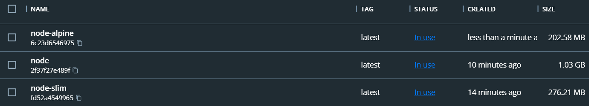
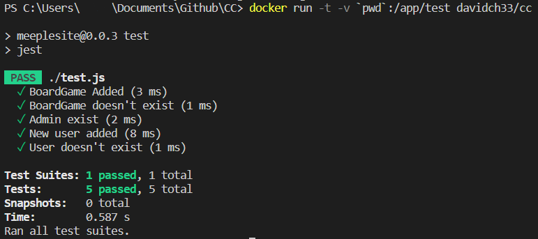
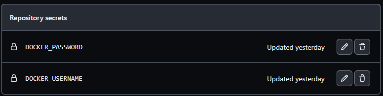
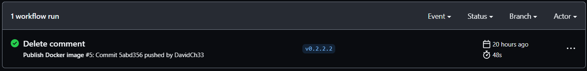
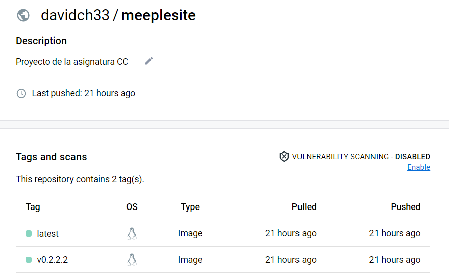
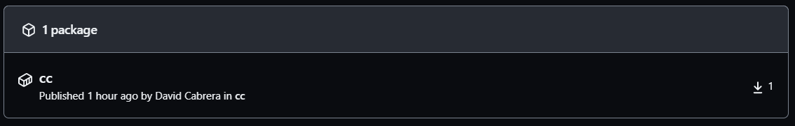

# Hito 3

## Elección de Contenedor
---
Una vez hemos instalado Docker Desktop debemos elegir el contenedor que vamos a utilizar. Algunas de las opciones a considerar son:

- Node: imagen generica del framework node.js. Utilizada cuando no tienes muy claro que es lo que necesitas.
- Node-slim: imagen con los paquetes mínimos para hacer funcionar node.js.
- Node-alpine: imagen construida sobre el sistema operativo Alpine que contiene node.js, cuyo objetivo es utilizar el menor espacio posible. 



Como podemos ver el contenedor que menos ocupa es node-alpine, por lo que será además la más eficiente en tiempo al disponer de menos dependencias que instalar. Debemos tener en cuenta que la imagen de Node dispone de una gran cantidad de paquetes que no vamos a necesitar para nustro proyecto, pusto que es una imagen de uso generico para cuando no se conoce muy bien lo que puedas necesitar. Por lo tanto, puesto que de ser necesario podemos instalar cualquier paquete nosotros mismo vamos a optar por la más libiana, en este caso, node-alpine. 
 
## Configuración de Dockerfile 
---
El archivo <a href="../Dockerfile">dockerfile</a> contiene la información necesaria para construir el contenedor de nuestro proyecto. En él hemos especificado:

El contenedor base sobre el que vamos a construir el nuestro:

```
FROM node:18-alpine
```

El directorio sobre el que se va a contruir la aplicación, especificado en la descripción incial del hito:

```
WORKDIR /app/test
```

El comando para copiar el contenido de package.json y package-lock.json:

```
COPY package*.json ./
```

La instrucción de nuestro gestor de tareas para iniciar las dependencias de nuestro proyecto:

```
RUN npm install
```

El comando para copiar las clases implementadas en nuestro proyecto:
```
COPY . .
```

Debemos matizar en este punto que al igual que disponemos de un archivo <a href="../.gitignore">.gitignore</a> para evitar que determinados archivos sean seguidos por git, debemos utilizar el archivo <a href="../.dockerignore">.dockerignore</a> en este mismo sentido a la hora de construir nuestro contenedor con Docker, evitando así copiar los archivos especificados al contenedor. En este archivo se ha indicado que no es necesario seguir la carpeta node_modules, puesto que se genera de forma automática por nuestro gestor de dependencias.

El puerto por el que accedemos a nuestra aplicación:

```
EXPOSE 5000
```

Y por último, el comando para ejecutar los test de nuestra aplicación:

```
CMD ["npm", "test"]
```

Vamos a comprobar que hemos configurado correctamente el contenedor para ello debemos ejecutar los siguientes comandos en la terminal:

```
docker build -t davidch33/cc .
docker run -t -v `pwd`:/app/test davidch33/cc
```



Como podemos ver ejecutando el comando especificado pasan correctamente los test de nuestra aplicación en el contenedor.

## Automatización de la publicación del contenedor Docker
---
A continuación, vamos a automatizar el proceso de publicación del contenedor docker de nuestra aplicación en docker hub. Para ello, vamos a hacer uso de las github action que nos proporciona github. Creamos un archivo <a href="../.github/docker.yml">yml</a> para configurar la github action, para ello hemos seguido la <a href="https://docs.github.com/en/actions/publishing-packages/publishing-docker-images">documentación oficial</a>, donde hemos modificado la acción que la ejecuta para cuando añadamos un tag con la expresión regular <i>v*</i>, como por ejemplo <i>v0.3</i>, y también hemos indicado en <span style="color:blue">image</span> el nombre de nuestro usuario y nuestro proyecto en docker hub: `davidch33/meeplesite`. 

```
name: Publish Docker image
on:
  push:
    tags:
      - v*
```

Dentro de github en el apartado Settings->Security->Secrets->Actions añadimos el usuario y la contraseña de docker hub.



Una vez hemos realizado el commit con la etiqueta correspondiente podemos ver como se ejecuta la github action:



Y podemos ver el contenedor en la cuenta de docker hub:



## GitHub Container Registry
---
Como registro alternativo de contenedores vamos a utilizar GitHub Container Registry, puesto que pertenece al mismo ecosistema que nuestro gestor de repositorios, y resulta más fácil su integración. Prueba de ello es que tan solo con añadir el archivo yml de la github action de la <a href="https://docs.github.com/en/actions/publishing-packages/publishing-docker-images#publishing-images-to-github-packages">documentación</a> funciona correctamente, puesto que las variables de entorno las proporciona github directamente. La única modificación que hemos realizado es el trigger de la github action para que coincida con la elegida para docker hub.

