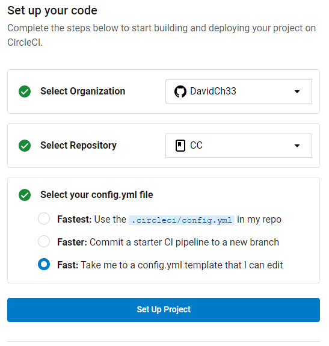
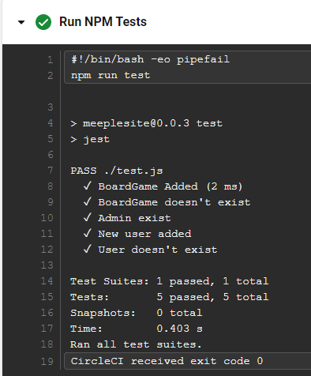
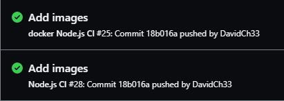

# Hito 4

En este hito vamos a añadir integración continua a nuestro proyecto, lo que nos va a permitir, junto con los test integrados, asegurar la calidad del software que desarrollamos. 

## Integración de herramienta de integración continua

Como primera herramienta de integración continua hemos elegido crear un workflow en github actions puesto que su integración con nuestro proyecto es sencilla al estar utilizando github para almacenar nuestro proyecto.

Para realizar la integración continua crearemos un nuevo archivo <a href="../.github/CI.yml">CI.yml</a> en nuestro proyecto donde los test se ejecutarán en una máquina virtual cuando realicemos un push a nuestra rama. El workflow tendrá la siguiente información:

- Ejecución cada vez que se realice un push

```
on: [push]
```

- Sistema operativo sobre el que se van a ejecutar los test

```
runs-on: ubuntu-latest
```

- Versión de Node.js de nuestro proyecto

```
node-version: '18.12.1'
```

- Instalación de las dependencias de nuestro proyecto

```
run: npm install
```

- Ejecución de los test de nuestro proyecto

```
run: npm test
```

Como podemos observar no ha sido necesario configurar ningún otro servicio externo para realizar la integración continua, sino que hemos podido llevarlo a cabo utilizando las herramientas que nos proporciona github directamente, lo que nos ha permitido en poco tiempo y de manera sencilla incorporar a nuestro proyecto la integración continua. Para la realización de esta parte hemos seguido la <a href="https://docs.github.com/en/actions/automating-builds-and-tests/building-and-testing-nodejs">documentación oficial proporcionada por github</a>.

## Integración de herramienta de integración continua adicional

Debemos elegir una segunda herramienta de integración continua. Dentro de las posibles elecciones CircleCI también se integra de una forma sencilla con github. Existen otras herramientas, como Jenkins, que necesita una instalación en el equipo para su funcionamiento, mientras que con CircleCI basta con conectar la github con su página web y añdir un <a href="../.circleci/config.yml">archivo yml</a> en la carpeta .circleci que es generado automáticamente por la plataforma.



En la siguiente imagen podemos ver como se han ejecutado los test de manera correcta dentro del <a href="https://app.circleci.com/pipelines/github/DavidCh33/CC">pipeline de nuestro proyecto</a>:



## Uso correcto del gestor de tareas y otras buenas prácticas

Hemos añadido y actualizado varias tareas en nuestro gestor de tareas que quizá tendríamos que haber creado en hitos anteriores:

- Hemos añadido al script `dev` la ejecución de los test antes de levantar nuestra aplicación.

```
"dev": "jest && nodemon app.js"
```

- Hemos creado un script `docker` para la creación y ejecución del contenedor docker.

```
"docker": "docker build -t davidch33/cc . && docker run -t -v app/test davidch33/cc"
```

## Aprovechamiento del contenedor

Vamos a ejecutar el contedor docker creado en el hito anterior utilizando un <a href="../.github/dockerCI.yml">nuevo workflow en github actions</a>. Para ello, debemos crear un arhivo yml parecido al descrito en el primer apartado, incluso más sencillo si cabe, y en lugar de utilizar `run: npm install` y `run: npm install`, usaremos la nueva tarea `npm run docker`.

A continuación podemos ver como se ejecutan correctamente los test en github actions, tanto el workflow que utiliza docker como la integración continua del primer apartado.

